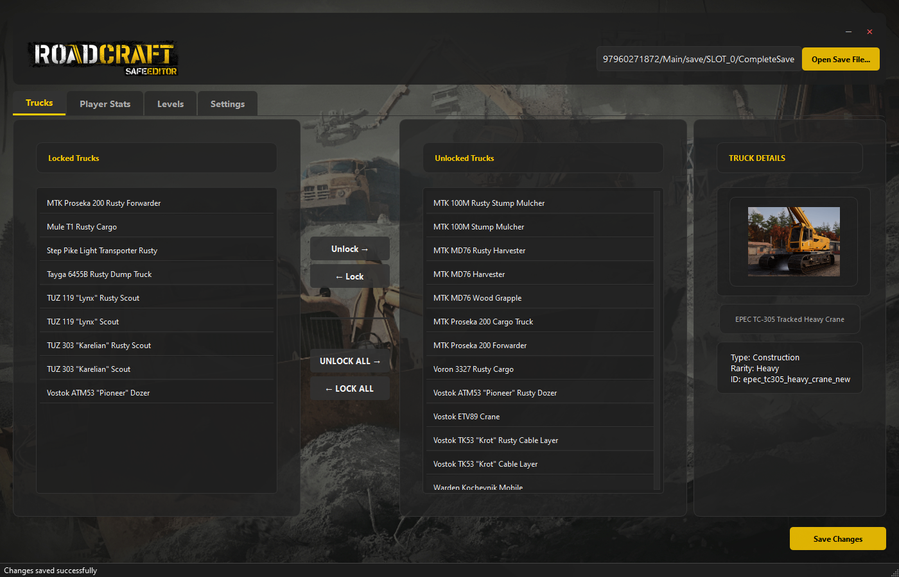
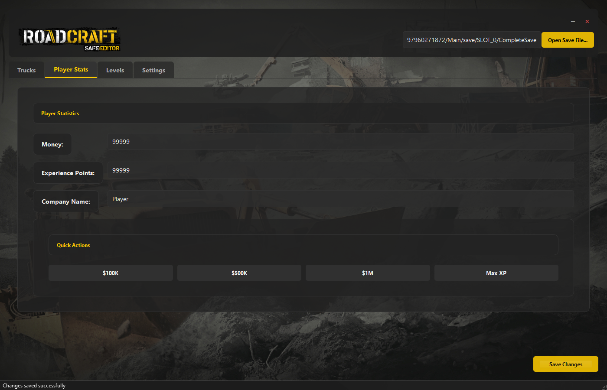
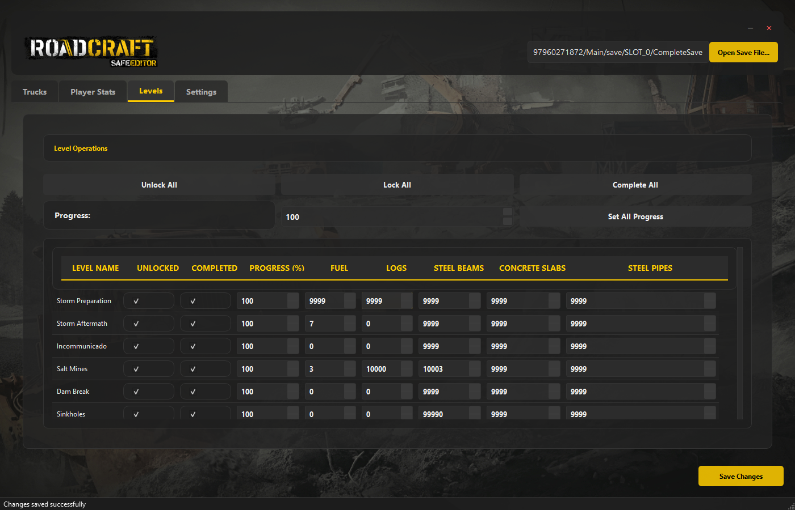

# 🚛 roadcraft save editor

RoadCraft save editor is a modern save file editor for RoadCraft, the infrastructure construction and logistics simulation game by Saber Interactive. Built with PyQt6, this tool allows you to modify your game progress, unlock vehicles and maps, and manage in-game resources.





## ✨ Features

### 🚚 Vehicle Management
- Unlock or lock individual trucks
- Bulk unlock/lock all trucks

### 📊 Player Statistics
- Modify in-game currency (money)
- Adjust experience points (XP)
- Change your company name

### 🗺️ Map Management
- Set level completion percentage
- Unlock or mark levels as completed:
  - Storm Preparation
  - Storm Aftermath
  - Incommunicado
  - Salt Mines
  - Dam Break
  - Sinkholes
  - Contamination
  - Washout
  - Sand Storm
  - Geothermal
- Edit level-specific resources (logs, steel beams, concrete slabs, steel pipes)
- Modify fuel and recovery coins

### 🛡️ Data Safety & Backups
- Automatic timestamped backups before saving changes

## 💻 Installation

### Option 1: Download Release
1. Go to the [Releases](https://github.com/YourUsername/RoadCraft-Save-Editor/releases) page
2. Extract the zip file
3. Run `RoadCraft SaveEditor.exe`

### Option 2: Run from Source

#### Requirements
- Python 3.12+
- PyQt6 (GUI framework)

```bash
# Install dependencies
pip install -r requirements.txt

# Run the editor
python main.py
```

### Option 3: Build Your Own Executable

```bash
# Make sure requirements are installed
pip install -r requirements.txt

# Build executable
python build_exe.py
```

## 🎮 How to Use

1. **Launch the RoadCraft Save Editor** (either the executable or from source)
2. **Open your save file**:
   - Click the "Open Save File" button
   - Navigate to your RoadCraft save file location:
     - `C:\Users\[YourUsername]\AppData\Local\Saber\RoadCraftGame\storage\steam\user\[SteamID]\Main\save\SLOT_[number]\CompleteSave`
3. **Make your desired changes** to vehicles, resources, or player stats
4. **Save your changes** by clicking the "Save" button
5. **Launch RoadCraft** to see your modifications in-game

## ⚠️ Usage Notes

- While automatic backups are created, manual backups are still recommended.
- Use at your own risk – modifying game files may affect gameplay or stability.

## 🗂️ Project Structure

```bash
├── main.py              # Application entry point
├── trucks.py            # Truck definitions and logic
├── style.py             # UI styling and themes
├── constants.py         # Configuration and constants
├── build_exe.py         # PyInstaller build script
├── images/
│   ├── trucks/          # Truck images
│   └── ui/              # UI graphics
├── screenshot/          # Screenshots for documentation
└── README.md            # This file
```

## 💾 Save File Format

- Proprietary RoadCraft format
- 53-byte header with metadata
- Zlib-compressed JSON payload
- MD5 hash for integrity verification
- Timestamped backups created automatically

## 🙏 Credits & Attribution

This project is heavily based on the excellent work from the original:

- Original project: [roadcraft-completesave](https://github.com/NakedDevA/roadcraft-completesave)

Key features adapted:
- Save file decompression/compression logic
- Proprietary format handling
- Base64 and zlib operations

## 🪄 About This Fork

This is a modern, GUI-based fork offering significant enhancements:

- Full PyQt6 GUI
- Visual truck gallery with images and stats
- Bulk actions for vehicles and maps
- Improved backup and save validation